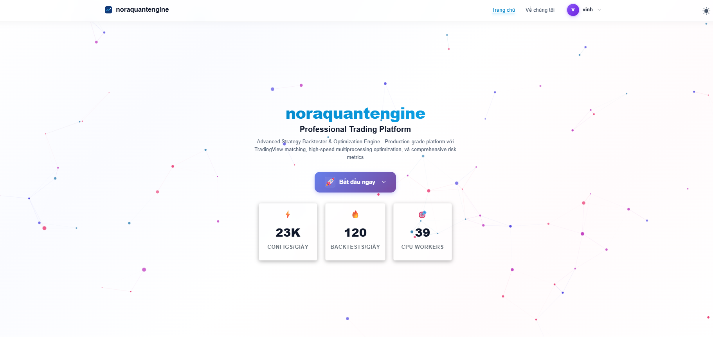
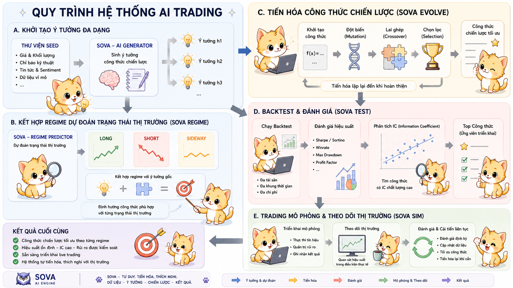
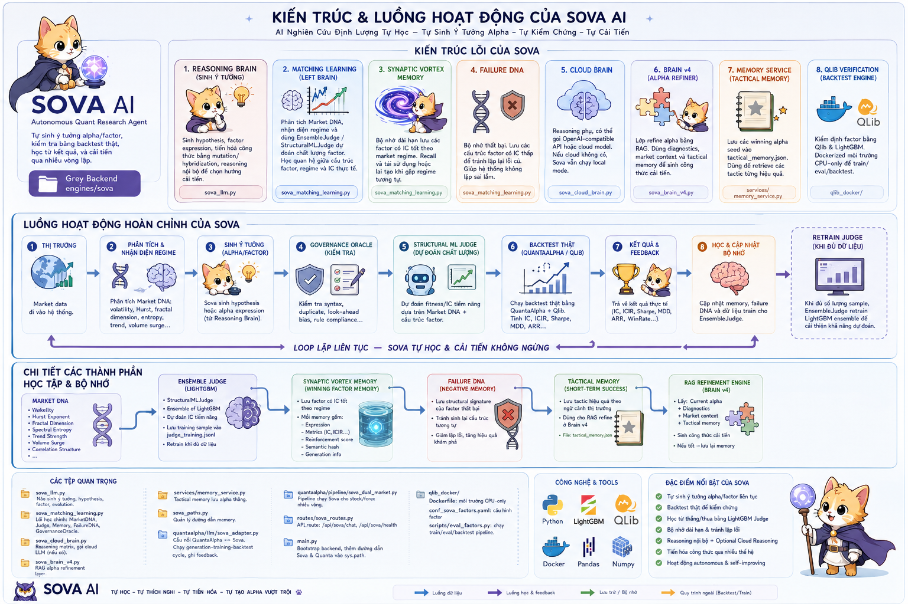
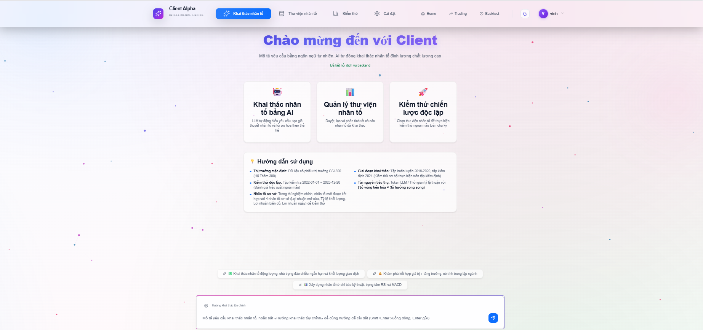
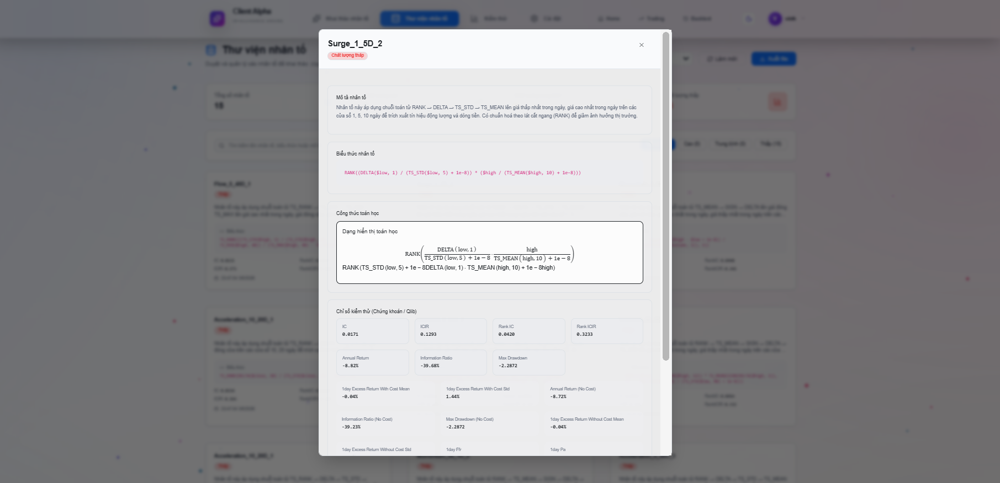
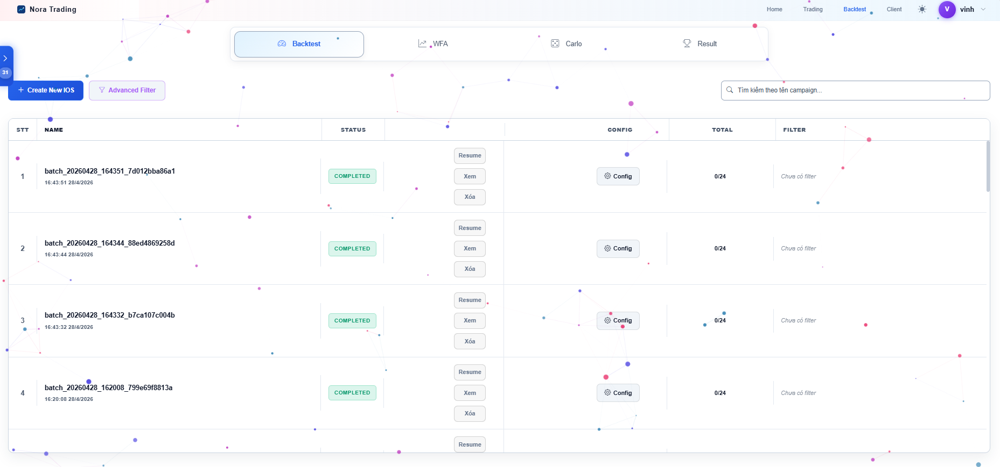
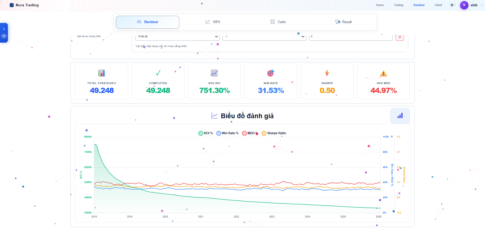
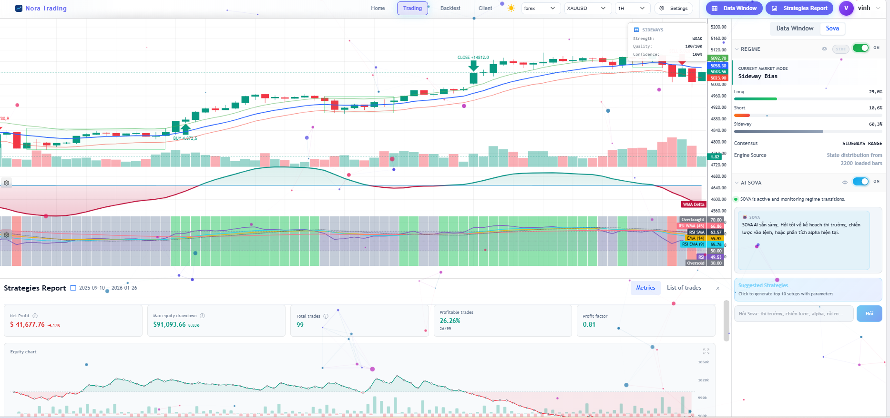
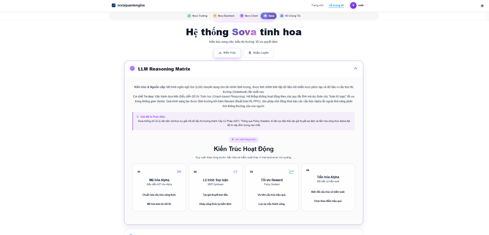
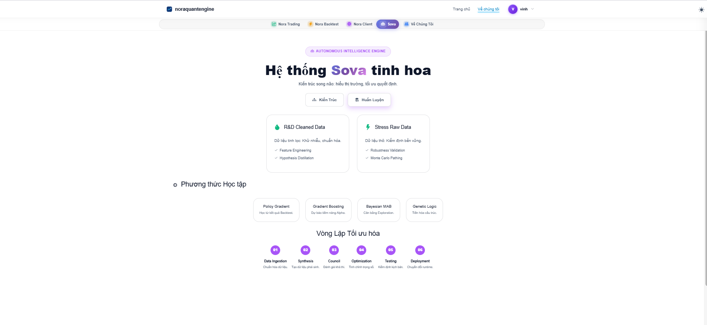

<div align="center">
  
</div>

<div align="center">

# Grey / NoraQuantEngine

**Nền tảng nghiên cứu định lượng, backtest, trading dashboard và AI factor discovery.**

Grey gom backend FastAPI, frontend React/Vite, engine backtest, Walk-Forward Analysis, Monte Carlo, SOVA AI và QuantaAlpha vào một workspace thống nhất cho nghiên cứu chiến lược giao dịch.

<p>
  <a href="https://github.com/Greyy2/Nora"></a>
  
  
  
  
  
</p>

<p>
  <a href="#tong-quan">Tổng quan</a> ·
  <a href="#module-chinh">Module chính</a> ·
  <a href="#sova-ai-factory">SOVA AI Factory</a> ·
  <a href="#ket-qua--tien-hoa">Kết quả</a> ·
  <a href="#demo-giao-dien">Demo giao diện</a> ·
  <a href="#quick-start">Quick start</a> ·
  <a href="#an-toan-public-repo">An toàn repo</a>
</p>

</div>

---

## Tổng Quan

Grey là một hệ thống full-stack phục vụ quy trình nghiên cứu định lượng từ dữ liệu thị trường đến kiểm định chiến lược, stress test, AI analysis và export báo cáo. Repo public này chỉ chứa code logic, cấu hình mẫu và tài liệu minh họa; dữ liệu chạy thật, kết quả, token và secret được loại khỏi Git.

```text
Market Data -> Regime -> SOVA AI Factory -> Backtest / WFA / Monte Carlo -> Trading Dashboard -> Reports / Export
```

| Layer | Thành phần | Vai trò |
| :--- | :--- | :--- |
| Frontend | React, Vite, Bootstrap, Plotly, Chart.js, lightweight-charts | Dashboard cho Home, Backtest, Trading, Client AI, Settings |
| Backend | FastAPI, Uvicorn, Pydantic | API orchestration, health checks, artifact routing |
| Storage | MongoDB, local runtime mounts | Lưu campaign, result document và lịch sử thực thi khi chạy local |
| Research Core | Backtest, WFA, Monte Carlo | Kiểm định chiến lược, robustness và stress test |
| AI Core | Grey AI, SOVA, QuantaAlpha | Phân tích thị trường, factor mining và factor library |
| Export | Google Sheets / Excel endpoints | Xuất kết quả sang workflow báo cáo |

---

## Module Chính

| Module | Màn hình | API / Engine | Giá trị chính |
| :--- | :--- | :--- | :--- |
| Nora Trading | `/trading` | `/api/single-core`, `/api/chart-data` | Kiểm tra chiến lược trên chart, data window và regime overlay |
| Nora Backtest | `/backtest` | `/api/backtest`, `/api/wfa`, `/api/carlo`, `/api/campaigns` | Chạy campaign, đọc kết quả, WFA, Monte Carlo và top strategies |
| Nora Client AI | `/client` | `/api/ai/quanta`, `/api/ai/quanta/v2` | Factor mining, factor library, backtest factor và live logs |
| SOVA AI | `/api/sova/*` | SOVA engine | AI reasoning layer cho phân tích và điều phối workflow |
| Sheets Export | `/api/sheets/*` | Google Sheets service | Export backtest/trade report khi cấu hình OAuth local |

---

## SOVA AI Factory

SOVA trong Grey không còn là một chức năng AI đơn lẻ. Nó là lớp AI factory cho toàn bộ bộ máy factor: đọc thị trường, hiểu regime, sinh công thức chiến lược từ ý tưởng ban đầu, tự kiểm chứng bằng backtest, chọn công thức đủ khả thi để đưa sang trading mô phỏng và giải thích chi tiết bằng LLM. Điểm quan trọng nhất là SOVA được thiết kế để tự hoàn thiện logic model fintech theo vòng lặp có feedback, không chỉ tạo text hay gọi một chỉ báo cố định.

<div align="center">
  
  <p><em>Luồng AI toàn hệ thống: từ seed ý tưởng, regime, tiến hóa công thức, backtest đến trading mô phỏng.</em></p>
</div>

<div align="center">
  
  <p><em>Kiến trúc SOVA: reasoning brain, matching learning, memory, failure DNA, cloud brain, tactical memory và Qlib verification.</em></p>
</div>

| Năng lực SOVA | Cách Grey sử dụng | Giá trị với factor engine |
| :--- | :--- | :--- |
| Regime prediction | Kết hợp market DNA, volatility, trend, volume, liquidity và trạng thái Long / Short / Sideway | Công thức chiến lược được gắn với bối cảnh thị trường thay vì đánh giá tĩnh |
| Idea-to-formula generation | Từ ý tưởng nghiên cứu ban đầu sinh hypothesis, factor expression và strategy blueprint | Biến mô tả tự nhiên thành logic có thể chạy trong pipeline |
| Strategy evolution | Mutation, crossover, parent selection và memory để cải tiến qua nhiều vòng | Tăng chất lượng công thức bằng feedback thay vì chỉ thử một lần |
| Backtest verification | Chạy backtest, đọc IC, Rank IC, ARR, MDD, Sharpe, Calmar và các metric rủi ro | Loại công thức yếu, phát hiện overfit và chọn ứng viên có khả năng triển khai |
| Simulation readiness | Chắt lọc top formula theo từng regime rồi đưa sang trading mô phỏng | Kiểm tra tính khả thi trong điều kiện gần thực tế trước production |
| LLM explanation | Giải thích vì sao công thức hoạt động, rủi ro nào cần tránh và regime nào phù hợp | Kết quả AI có thể audit, đọc lại và cải tiến |
| Self-building fintech logic | SOVA dùng memory, failure DNA và tactical refinement để tự cập nhật hướng nghiên cứu | Hệ thống tiến hóa như một quant research agent, không phải một chatbot phụ trợ |

---

## Kết Quả & Tiến Hóa

Grey dùng bảng kết quả theo tinh thần của QuantaAlpha và RD-Agent: tách rõ benchmark tham chiếu, validation gate nội bộ và kết quả chạy thật. Repo public không commit artifact production, vì vậy các bảng dưới đây chỉ ghi những số có nguồn trong README tham chiếu hoặc script validation đang nằm trong repo.

| Mô hình / agent | Bộ đánh giá | Metric chính | Kết luận |
| :--- | :--- | :--- | :--- |
| QuantaAlpha public reference | Main factor experiment | IC `0.1501`, Rank IC `0.1465`, ARR `27.75%`, MDD `7.98%`, Calmar `3.4774` | Mốc tham chiếu cho factor mining tự tiến hóa |
| RD-Agent(Q) public reference | Quant finance agent benchmark | ARR khoảng `2x` so với benchmark factor libraries, dùng ít hơn `70%+` số factor | Mốc tham chiếu cho automatic quant factory và factor-model co-optimization |
| SOVA V5.2 Elite Gate | `verify_v5_2_elite.py` | Elite IC `0.07`; overfit IC `0.12` bị phạt bởi IC wall `0.1` | Ưu tiên công thức ổn định hơn công thức có vẻ quá đẹp nhưng dễ overfit |
| SOVA Fusion V4 - Stock Dominance | `validate_fusion_v4.py` | Stock IC `0.07`, Forex IC `0.01`, ARR stock mock `0.25` | Hệ thống tự chuyên biệt hóa sang thị trường có tín hiệu mạnh |
| SOVA Fusion V4 - Universal Strategy | `validate_fusion_v4.py` | Stock IC `0.06`, Forex IC `0.055` | Hệ thống giữ chế độ dual-market khi cả hai thị trường đều đạt ngưỡng |
| Grey production runs | Local `results/`, `data/results/`, MongoDB campaigns | Sharpe, Sortino, Winrate, Profit Factor, MDD, Calmar, IC/ICIR | Kết quả thật được lưu local khi chạy, không đưa vào public repo để giữ an toàn dữ liệu |

| Vòng tiến hóa | Trạng thái công thức | Gate đánh giá | Quyết định của hệ thống |
| :--- | :--- | :--- | :--- |
| Seed | Ý tưởng/hypothesis ban đầu | Kiểm tra dữ liệu đầu vào và regime | Giữ nhiều hướng nghiên cứu để tránh bias |
| Regime routing | Công thức được gắn Long / Short / Sideway | Market DNA, volatility, trend, liquidity | Chỉ so công thức trong bối cảnh thị trường phù hợp |
| Evolution round | Mutation/crossover từ parent tốt | IC, Rank IC, ICIR, diversity penalty | Tăng khả năng tìm alpha mới nhưng vẫn giữ đa dạng |
| Backtest filter | Công thức chạy qua backtest | ARR, MDD, Sharpe, Calmar, Profit Factor | Loại công thức yếu hoặc rủi ro quá cao |
| Simulation candidate | Top formula theo từng regime | Stability, drawdown guardrail, explanation quality | Đưa sang trading mô phỏng và tiếp tục theo dõi |

### Stats

<p>Phần stats dưới đây dùng SVG card endpoint để GitHub README render ổn định, thay cho các block chart beta dễ bị mất hoặc không hiện đúng.</p>

<table>
  <tr>
    <td align="center" width="50%">
      
    </td>
    <td align="center" width="50%">
      
    </td>
  </tr>
  <tr>
    <td align="center" width="50%">
      
    </td>
    <td align="center" width="50%">
      
    </td>
  </tr>
</table>

<p align="center"><em>UTC offset đang đặt là `+7` để khớp múi giờ làm việc của bạn; nếu cần mình có thể đổi theme hoặc bố cục để sát ảnh mẫu hơn nữa.</em></p>

---

## Demo Giao Diện

<div align="center">
  
  <p><em>Nora Client AI workspace cho factor mining và live evolution logs.</em></p>
</div>

<table>
  <tr>
    <td align="center" width="50%">
      
      <br />
      <strong>Factor Library</strong>
    </td>
    <td align="center" width="50%">
      
      <br />
      <strong>Backtest Dashboard</strong>
    </td>
  </tr>
  <tr>
    <td align="center" width="50%">
      
      <br />
      <strong>Backtest Results</strong>
    </td>
    <td align="center" width="50%">
      
      <br />
      <strong>Nora Trading</strong>
    </td>
  </tr>
</table>

<table>
  <tr>
    <td align="center" width="50%">
      
      <br />
      <strong>SOVA AI Architecture</strong>
    </td>
    <td align="center" width="50%">
      
      <br />
      <strong>SOVA Training Workflow</strong>
    </td>
  </tr>
</table>

---

## Quick Start

### 1. Clone repo

```bash
git clone git@github.com:Greyy2/Nora.git
cd Nora
```

### 2. Cấu hình môi trường local

```bash
cp .env.example .env
cp frontend/.env.example frontend/.env.local
```

Nếu dùng Google Sheets export, tạo thêm `sheet/.env` từ `sheet/.env.example` và điền OAuth secret ở máy local.

### 3. Chạy bằng Docker

```bash
docker compose -f docker/docker-compose.yml up --build
```

```text
Frontend: http://localhost:5720/backtest
Backend:  http://localhost:8000
MongoDB:  mongodb://localhost:27020
```

### 4. Chạy local để phát triển

Backend:

```bash
python -m venv venv
source venv/bin/activate
pip install -r backend/requirements.txt
uvicorn backend.main:app --reload --host 0.0.0.0 --port 8000
```

Frontend:

```bash
cd frontend
npm install
npm run dev
```

Mở ứng dụng tại:

```text
http://localhost:5721/backtest
```

---

## Cấu Trúc Repo

```text
Grey/
├── backend/          # FastAPI app, routes, services, engines, optimize modules
├── frontend/         # React/Vite UI source
├── docker/           # Dockerfiles and docker-compose
├── docs/images/      # README screenshots
├── .env.example      # Local config template without secrets
└── start.sh          # Helper script for local/server startup
```

Các thư mục runtime như `data/`, `results/`, `log/`, `tmp/`, `frontend/node_modules/`, `frontend/dist/`, `sheet/`, `nginx/` và experiment artifacts không được commit.

---

## An Toàn Public Repo

Repo này được chuẩn bị theo nguyên tắc public-safe:

| Không commit | Lý do |
| :--- | :--- |
| `.env`, `.env.local`, `sheet/*.json`, `sheet/.env` | Chứa API key, OAuth secret, token hoặc service account |
| `nginx/` | Chứa cấu hình triển khai local/domain/server, không phù hợp để đưa lên repo public |
| `data/`, `results/`, `backend/engines/*/data` | Dữ liệu thị trường và artifact chạy thật |
| `frontend/node_modules/`, `frontend/dist/` | Dependency/build output có thể tái tạo |
| `log/`, `tmp/`, `mlruns/`, `cache/`, `*.pkl`, `*.csv` | Runtime logs, model/cache/result files |

Grey là hệ thống nghiên cứu và kiểm định chiến lược. Kết quả backtest, AI analysis và factor mining không phải lời khuyên đầu tư; mọi claim hiệu năng cần benchmark có thể tái lập trước khi dùng cho production.

<div align="center">

**Grey / NoraQuantEngine**  
Research -> Backtest -> Trading -> AI -> Export

</div>
