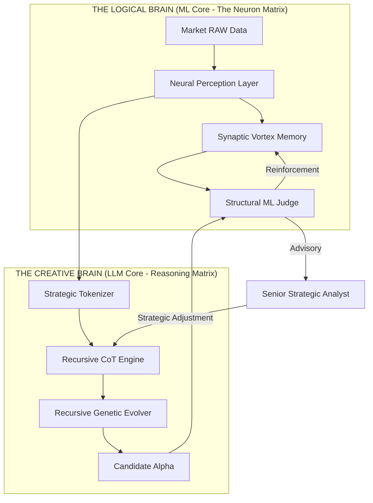
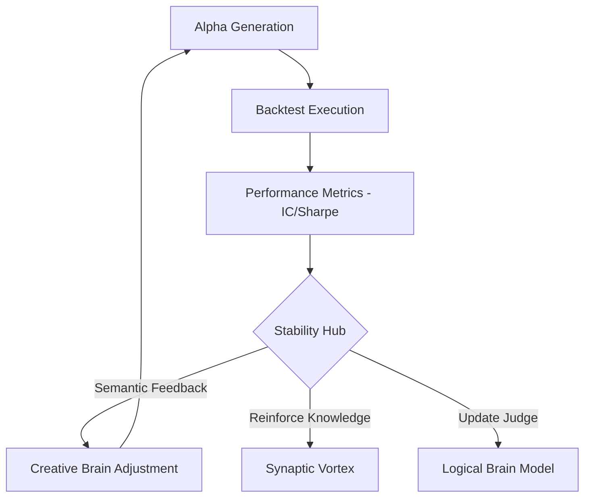

# Senior SOVA: Expert Dual-Core Cognitive Intelligence

This document details the final, code-dense architecture of SOVA, designed as a 100% autonomous financial agent functioning without external APIs or high-resource hardware.

---

## 1. High-Level Cognitive Architecture (Global Flow)

SOVA is architected as a **Dual-Core Neuro-Matrix**, where logic and creativity work in a continuous, self-optimizing feedback loop.

---

## 2. The Logical Mind: Neuron Matrix & Perception

Designed for **High-Precision Sense** and **Reinforced Memory Retrieval**.

### A. Neuron Perception Layer (Sense)
The "neurons" of SOVA's perception use advanced signal processing to decompose market noise:
- **Kalman Signal Denoising**: Extracting the structural trend from volatile price action.
- **Spectral Entropy**: Measuring the disorder of returns via Welch's power spectrum.
- **Fractal Complexity (Higuchi)**: Quantifying the self-similarity of price paths.
- **Hurst Persistence**: Sensing whether the current regime is trending or mean-reverting.

### B. Synaptic Vortex Memory (REINFORCE)
A bio-inspired sharded knowledge base:
- **Sharded Memory**: Knowledge is sharded by Market Regime (e.g., `CAPITULATION_CRASH`, `EXPONENTIAL_BULL`).
- **Long-Term Potentiation**: Successful alphas reinforce existing synapses, increasing their probability of recall.
- **Selective Forgetting**: Automatic decay of weak or redundant knowledge to prevent over-fitting.

---

## 3. The Creative Mind: Recursive Reasoning & Evolution

Designed for **Unlimited Strategic Innovation**.

### A. Recursive Thinking Core (Reasoning)
SOVA simulates a Transformer-style reasoning engine without an external LLM:
- **Structural Tokenization**: Alpha expressions are tokenized into "genes" (tokens).
- **Next-Gene Prediction**: The reasoning engine deliberates on the most likely "optimal gene" based on current market axioms.
- **Chain-of-Thought (CoT)**: Multi-stage monologue that aligns perception with strategic intent (Momentum vs. Reversion).

### B. Recursive Alpha Evolver (Generate)
Creative alpha synthesis through **Structural Stacking**:
- **Atomic Mutation**: Randomly substituting variables (tokens) to discover hidden correlations.
- **Structural Hybridization**: Cross-breeding successful alphas with strategic intents (e.g., Mean Reversion filters).
- **Syntactic Governance**: Ensures every synthesized alpha is mathematically sound and free of look-ahead bias.

---

## 5. The Continuous Stability Hub (Feedback & Learning)

Inspired by the R&D feedback loops of **QuantaAlpha** and **RD-Agent**, SOVA integrates a specialized module for **Continuous Stability & Precision**.

### A. Semantic Feedback Engine
Instead of brute-force learning, SOVA's summarizer distills failed experiments into **Causal Feedback**:
- **Blunder Identification**: Detecting if a failure was due to bad math, noise, or regime mismatch.
- **Strategic Directional Signal**: Guiding the Creative Brain to shift focus (e.g., "Reduce sensitivity to tail risk in Volatile regimes").

### B. The Stability Governance Matrix
This "Inner Auditor" ensures the system remains stable over thousands of iterations:
- **Redundancy Filter**: Prevents the creation of Alphas that are too similar to existing ones.
- **Governance Gate**: All Alphas must pass a mathematical "Stationarity Test" before being stored in memory.
- **Incremental Evolution**: The feedback loop ensures that mutation is not random but **Focused** on rectifying identified flaws from previous rounds.

---

## 6. Senior Summary: The Learning Loop

SOVA achieves **Autonomous Intelligence Growth** through its performance feedback loop:

This ensures that every session makes SOVA smarter, more precise, and fundamentally more stable by learning from **Trọng tâm (Key Focus Points)** rather than generic noise.
